## Geraldo Schuetze

**Data Engineer** — I design, build and operate data platforms end to end: ingestion, dimensional modeling, orchestration, data quality and governance.

Right now I run the **Brazil Economy Observatory** — a production ELT platform over Brazilian public economic data, live 24/7 on an Oracle Cloud Always Free ARM VM.

### How it works

```mermaid
flowchart LR
    subgraph SRC["Public sources"]
        direction TB
        BACEN["BACEN<br/>SGS · PIX · Focus"]
        CVM["CVM<br/>daily fund reports · CDA"]
        IBGE["IBGE<br/>IPCA"]
    end

    ING["<b>Apache Airflow 3</b><br/>6 ingestion DAGs<br/>idempotent, incremental<br/>cron aligned to each publisher"]
    RAW[("raw<br/>PostgreSQL 16")]
    EVT{{"Assets<br/>all 6 sources ready"}}
    DBT["<b>dbt_transform</b><br/>event-driven, not cron<br/>51 tests + source freshness"]
    STG[("staging<br/>9 models")]
    MRT[("marts<br/>17 models · star schema")]
    SUP["<b>Apache Superset</b><br/>public dashboard · ~29 charts"]
    OM["<b>OpenMetadata</b><br/>column-level lineage · glossary"]
    CF["Cloudflare Tunnel<br/>TLS · no inbound ports on the VM"]
    VIS(["Visitor — no login"])

    SRC --> ING
    ING --> RAW
    ING -. emits .-> EVT
    EVT -. triggers .-> DBT
    RAW --> DBT
    DBT --> STG --> MRT
    MRT --> SUP
    MRT -. catalogued .-> OM
    SUP --> CF
    OM --> CF
    CF --> VIS
```

The interesting part is the dotted path: ingestion doesn't schedule the transform. Each DAG emits an Airflow **Asset** when its source lands, and `dbt_transform` runs only once all six have arrived — so a late publication from BACEN delays the build instead of silently producing a partial one.

### See it running

| | |
|---|---|
| **Dashboard** (Superset) | **[Open it →](https://economy.geraldoschuetze.com/superset/dashboard/visao-geral/)** — public, no login |
| **Data catalog** (OpenMetadata) | [economy-catalog.geraldoschuetze.com](https://economy-catalog.geraldoschuetze.com) — read-only guest, credentials in the repo README |
| **Source** | [brazil-economy-observatory-public](https://github.com/geraldoschuetze/brazil-economy-observatory-public) |

**8 Airflow pipelines** · **51 dbt data-quality tests** · **4 institutions, 7+ public APIs** · **3 environments** promoted DEV → QA → PROD through GitHub Actions · column-level lineage and glossary in the catalog · ~29 charts.

### Stack

`Apache Airflow 3` · `dbt` · `PostgreSQL 16` · `Apache Superset` · `OpenMetadata` · `Python 3.12` · `Docker Compose` · `GitHub Actions` · `Cloudflare Tunnel` · `Oracle Cloud (ARM)`

### Projects

| Repo | What it is |
|---|---|
| [**brazil-economy-observatory-public**](https://github.com/geraldoschuetze/brazil-economy-observatory-public) | End-to-end ELT observatory for Brazilian public economic data — Airflow, dbt, PostgreSQL, Superset, OpenMetadata. Spec-driven, security-first, no inbound ports. |
| [**security-kit-agent**](https://github.com/geraldoschuetze/security-kit-agent) | OSS security kit for Claude Code and the Gemini CLI. Combines rule-based scanning (Trivy, Semgrep, Gitleaks, ZAP) with semantic review for the flaws rules miss — broken authorization, IDOR, business-logic bugs. |
| [**bw-connect-setup**](https://github.com/geraldoschuetze/bw-connect-setup) | Unlock a Bitwarden vault from the terminal in one command. The session is reusable by scripts; no secret is ever written to disk. |
